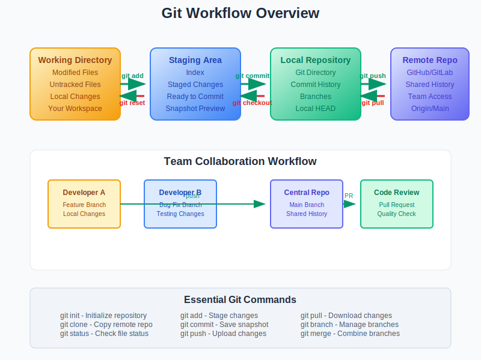
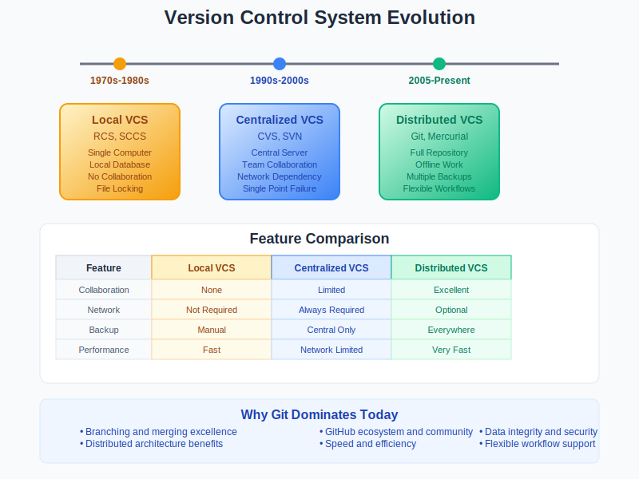
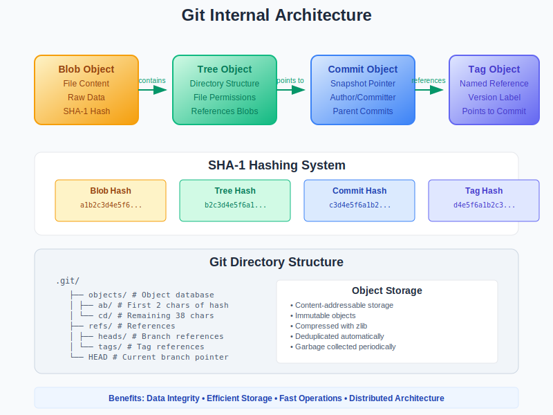
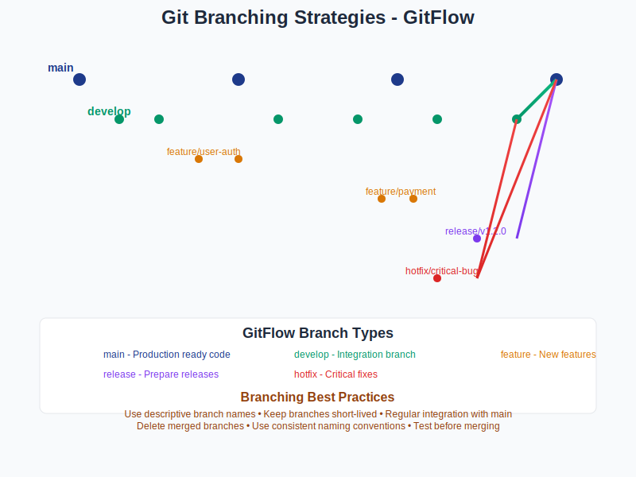
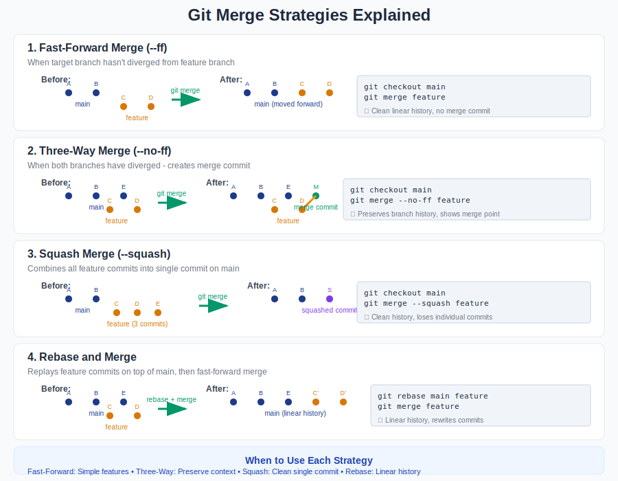
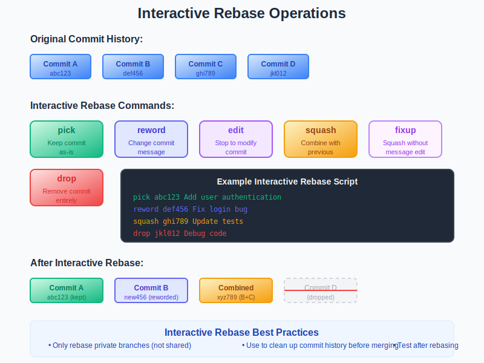
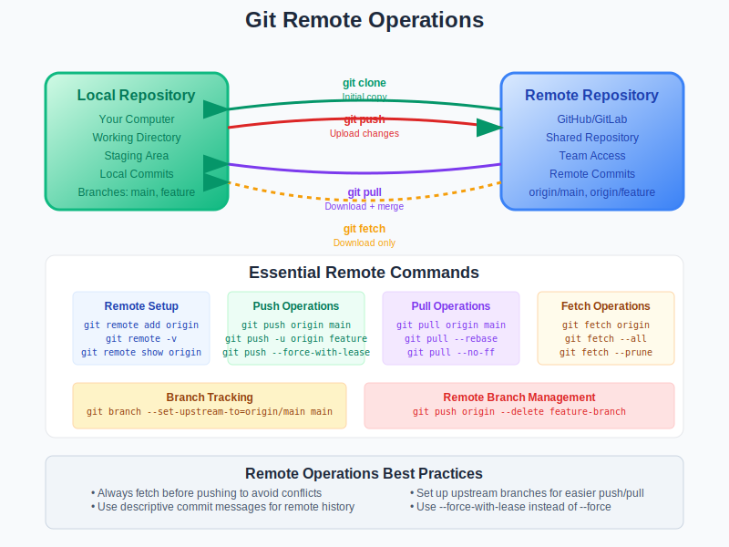
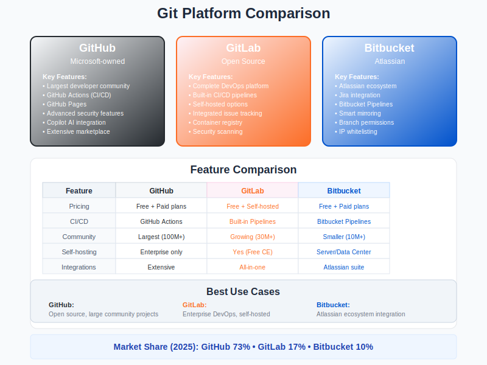

# 🔀 Session 3: Mastering Git
## *Version Control & Collaboration for DevOps Excellence*

<div align="center">


**Duration:** 2 Weeks | **Level:** Beginner to Intermediate | **Type:** Theory + Hands-on

---

### 📅 **Last Updated**
<table>
<tr>
<td align="center" width="20%">

</td>
<td align="center" width="20%">

</td>
<td align="center" width="20%">

</td>
<td align="center" width="20%">

</td>
<td align="center" width="20%">

</td>
</tr>
</table>

</div>

---

## 📋 Presentation Navigation
<div align="center">

| [🎯 Overview](#-slide-1-session-overview) | [📚 Learning Goals](#-slide-2-learning-objectives) | [🔄 Version Control](#-slide-3-version-control-fundamentals) | [🔀 Git Basics](#-slide-4-git-fundamentals) |
|:---:|:---:|:---:|:---:|
| [🌿 Branching](#-slide-5-git-branching-mastery) | [🔗 Merging](#-slide-6-merging--conflict-resolution) | [🔄 Rebase & History](#-slide-7-rebase--history-management) | [🌐 Remote Repos](#-slide-8-remote-repositories) |
| [🤝 Collaboration](#-slide-9-collaboration-workflows) | [🚀 GitLab/GitHub](#-slide-10-gitlab--github-mastery) | [⚙️ CI/CD Integration](#-slide-11-cicd-integration) | [🎓 Next Steps](#-slide-12-next-steps--mastery) |

</div>

---

## 🎯 Slide 1: Session Overview

<div align="center">

### 🌟 **Master Git for DevOps Excellence**



</div>

> **Mission:** Transform your development workflow with professional Git mastery and team collaboration skills

### 🎪 **Why Git Matters for DevOps**
```
🌍 95% of Development Teams    📊 100% of Open Source Projects    🔧 Essential DevOps Skill
💰 Version Control = Job Security    🚀 Collaboration Superpower    🎯 Industry Standard
```

### 📅 **Session Structure**
- **Week 1:** Git fundamentals, branching, and merging
- **Week 2:** Advanced workflows, collaboration, and CI/CD integration

### 🎯 **Target Audience**
- Developers new to version control
- DevOps engineers building collaboration skills
- Teams transitioning to Git workflows
- Professionals seeking Git mastery

---

## 📚 Slide 2: Learning Objectives

<div align="center">

### 🎓 **By the End of This Session, You Will:**

</div>

<table>
<tr>
<td width="50%">

### 🧠 **Core Git Skills**
- ✅ **Understand** version control concepts and Git architecture
- ✅ **Create and manage** Git repositories effectively
- ✅ **Master branching** strategies and workflows
- ✅ **Resolve conflicts** and handle complex merges

</td>
<td width="50%">

### 🛠️ **Professional Workflows**
- ✅ **Collaborate** using remote repositories
- ✅ **Implement** GitFlow and feature branch workflows
- ✅ **Integrate** CI/CD with Git platforms
- ✅ **Apply** industry best practices

</td>
</tr>
</table>

### 🎯 **Success Metrics**
```
Git Commands: 30+ mastered | Branching: Advanced strategies | Collaboration: Team workflows
```

---

## 🔄 Slide 3: Version Control Fundamentals

<div align="center">

### 📚 **Understanding Version Control Systems**



</div>

### 🏗️ **Version Control Benefits**

<table>
<tr>
<td width="33%">

### 📈 **Track Changes**
*Complete History*
- 🕐 Timeline of modifications
- 👤 Author identification
- 📝 Commit messages
- 🔍 Diff comparisons

</td>
<td width="33%">

### 🤝 **Collaboration**
*Team Productivity*
- 👥 Multiple developers
- 🔄 Parallel development
- 🔀 Merge capabilities
- 🛡️ Conflict resolution

</td>
<td width="33%">

### 🔒 **Safety & Backup**
*Risk Management*
- 💾 Distributed copies
- ⏪ Rollback capability
- 🌿 Branching strategies
- 🔐 Access control

</td>
</tr>
</table>

### 📊 **VCS Evolution Timeline**
```
Local VCS (1970s) → Centralized VCS (1990s) → Distributed VCS (2000s) → Git Dominance (2010s+)
```

---

## 🔀 Slide 4: Git Fundamentals

<div align="center">

### ⚡ **Git Architecture & Core Concepts**



</div>

<table>
<tr>
<td width="50%">

### 🏗️ **Git Architecture**
- **Working Directory** - Your current files
- **Staging Area** - Prepared changes
- **Local Repository** - Committed history
- **Remote Repository** - Shared codebase

### 🔧 **Essential Commands**
```bash
git init          # Initialize repository
git add .         # Stage changes
git commit -m     # Commit changes
git status        # Check status
git log           # View history
```

</td>
<td width="50%">

### 📊 **Git States**
- **Modified** - Changed but not staged
- **Staged** - Ready for commit
- **Committed** - Saved in repository
- **Pushed** - Shared to remote

### 🎯 **Git Workflow**
```
Modify → Stage → Commit → Push
```

**🔄 Basic Cycle:**
Edit files → `git add` → `git commit` → `git push`

</td>
</tr>
</table>

### 💡 **Git vs Other VCS**
- **Distributed** - Every clone is a full backup
- **Fast** - Local operations are lightning quick
- **Flexible** - Multiple workflow support
- **Secure** - SHA-1 hash integrity

---

## 🌿 Slide 5: Git Branching Mastery

<div align="center">

### 🌳 **Branching Strategies & Workflows**



</div>

<table>
<tr>
<td width="50%">

### 🌿 **Branch Operations**
```bash
# Create and switch to branch
git checkout -b feature/new-feature
git switch -c feature/new-feature

# List branches
git branch -a

# Switch branches
git checkout main
git switch develop

# Delete branch
git branch -d feature/completed
```

### 🎯 **Branch Types**
- **main/master** - Production code
- **develop** - Integration branch
- **feature/** - New features
- **hotfix/** - Critical fixes
- **release/** - Release preparation

</td>
<td width="50%">

### 🔄 **GitFlow Strategy**
1. **Feature branches** from develop
2. **Develop** integrates features
3. **Release branches** for testing
4. **Main** for production releases
5. **Hotfix branches** for urgent fixes

### 📊 **Branch Naming**
```
feature/user-authentication
bugfix/login-error
hotfix/security-patch
release/v1.2.0
```

</td>
</tr>
</table>

### 🎯 **Best Practices**
- Keep branches focused and short-lived
- Use descriptive branch names
- Regular integration with main branch
- Delete merged branches

---

## 🔗 Slide 6: Merging & Conflict Resolution

<div align="center">

### 🤝 **Merge Strategies & Conflict Resolution**



</div>

<table>
<tr>
<td width="50%">

### 🔀 **Merge Types**
```bash
# Fast-forward merge
git merge feature/simple

# Three-way merge
git merge feature/complex

# Squash merge
git merge --squash feature/cleanup

# No fast-forward
git merge --no-ff feature/important
```

### 🎯 **Merge Strategies**
- **Fast-forward** - Linear history
- **Three-way** - Merge commit created
- **Squash** - Combine commits
- **Rebase** - Replay commits

</td>
<td width="50%">

### ⚔️ **Conflict Resolution**
```bash
# When conflicts occur
git status
git diff

# Resolve conflicts manually
# Edit conflicted files
git add resolved-file.txt
git commit

# Abort merge if needed
git merge --abort
```

### 🛠️ **Conflict Tools**
- **VS Code** - Built-in merge editor
- **GitKraken** - Visual merge tool
- **Meld** - Three-way comparison
- **P4Merge** - Professional tool

</td>
</tr>
</table>

### 💡 **Conflict Prevention**
- Frequent pulls from main branch
- Small, focused commits
- Clear communication in teams
- Regular integration testing

---

## 🔄 Slide 7: Rebase & History Management

<div align="center">

### 📚 **Rebase Operations & History Cleanup**



</div>

<table>
<tr>
<td width="50%">

### 🔄 **Rebase Operations**
```bash
# Interactive rebase
git rebase -i HEAD~3

# Rebase onto main
git rebase main

# Continue after conflicts
git rebase --continue

# Abort rebase
git rebase --abort
```

### 🎯 **Rebase vs Merge**
- **Rebase** - Linear, clean history
- **Merge** - Preserves branch context
- **Use rebase** - Feature branches
- **Use merge** - Integration points

</td>
<td width="50%">

### 📊 **History Management**
```bash
# View history
git log --oneline --graph
git log --author="John"
git log --since="2 weeks ago"

# Amend last commit
git commit --amend

# Reset operations
git reset --soft HEAD~1
git reset --hard HEAD~1

# Cherry-pick commits
git cherry-pick abc123
```

### 🔍 **History Tools**
- **gitk** - Visual history browser
- **tig** - Text-mode interface
- **GitLens** - VS Code extension
- **GitHub Desktop** - GUI client

</td>
</tr>
</table>

### ⚠️ **Rebase Golden Rule**
**Never rebase commits that have been pushed to shared repositories!**

---

## 🌐 Slide 8: Remote Repositories

<div align="center">

### 🌍 **Working with Remote Repositories**



</div>

<table>
<tr>
<td width="50%">

### 🌐 **Remote Operations**
```bash
# Add remote
git remote add origin https://github.com/user/repo.git

# List remotes
git remote -v

# Fetch changes
git fetch origin

# Pull changes
git pull origin main

# Push changes
git push origin feature/new-feature

# Set upstream
git push -u origin main
```

</td>
<td width="50%">

### 🔄 **Sync Strategies**
```bash
# Fetch before work
git fetch origin
git status

# Pull with rebase
git pull --rebase origin main

# Force push (dangerous!)
git push --force-with-lease

# Track remote branch
git branch -u origin/main
```

### 🎯 **Remote Best Practices**
- Always fetch before starting work
- Use meaningful commit messages
- Push regularly to backup work
- Never force push to shared branches

</td>
</tr>
</table>

### 🔐 **Authentication Methods**
- **HTTPS** - Username/password or token
- **SSH** - Key-based authentication (recommended)
- **Personal Access Tokens** - GitHub/GitLab tokens
- **OAuth** - Third-party authentication

---

## 🤝 Slide 9: Collaboration Workflows

<div align="center">

### 👥 **Team Collaboration Strategies**


</div>

<table>
<tr>
<td width="50%">

### 🔄 **GitFlow Workflow**
- **Main** - Production releases
- **Develop** - Integration branch
- **Feature** - New development
- **Release** - Release preparation
- **Hotfix** - Critical fixes

### 🎯 **Feature Branch Workflow**
```bash
# Create feature branch
git checkout -b feature/user-login

# Work and commit
git add .
git commit -m "Add login form"

# Push and create PR
git push origin feature/user-login
```

</td>
<td width="50%">

### 🚀 **GitHub Flow**
1. Create branch from main
2. Add commits
3. Open Pull Request
4. Discuss and review
5. Deploy and test
6. Merge to main

### 📋 **Pull Request Process**
- **Create** - Descriptive title and description
- **Review** - Code review by peers
- **Test** - Automated CI/CD checks
- **Merge** - Integration to main branch

</td>
</tr>
</table>

### 🎯 **Team Best Practices**
- Use consistent branch naming conventions
- Write clear commit messages
- Review code before merging
- Maintain clean history

---

## 🚀 Slide 10: GitLab & GitHub Mastery

<div align="center">

### 🌟 **Platform-Specific Features**



</div>

<table>
<tr>
<td width="50%">

### 🦊 **GitLab Features**
- **Built-in CI/CD** - Integrated pipelines
- **Issue Tracking** - Project management
- **Wiki** - Documentation
- **Container Registry** - Docker images
- **Security Scanning** - Vulnerability detection

### 🔧 **GitLab CI/CD**
```yaml
# .gitlab-ci.yml
stages:
  - test
  - build
  - deploy

test:
  stage: test
  script:
    - npm test
```

</td>
<td width="50%">

### 🐙 **GitHub Features**
- **Actions** - CI/CD workflows
- **Issues** - Bug tracking
- **Projects** - Kanban boards
- **Packages** - Package registry
- **Codespaces** - Cloud development

### ⚡ **GitHub Actions**
```yaml
# .github/workflows/ci.yml
name: CI
on: [push, pull_request]
jobs:
  test:
    runs-on: ubuntu-latest
    steps:
      - uses: actions/checkout@v2
      - run: npm test
```

</td>
</tr>
</table>

### 🎯 **Platform Selection**
- **GitLab** - Complete DevOps platform, self-hosted options
- **GitHub** - Largest community, excellent integrations
- **Bitbucket** - Atlassian integration, enterprise features

---

## ⚙️ Slide 11: CI/CD Integration

<div align="center">

### 🔄 **Continuous Integration & Deployment**


</div>

<table>
<tr>
<td width="50%">

### 🔄 **CI/CD Pipeline**
1. **Code Push** - Developer commits
2. **Trigger** - Automated pipeline start
3. **Build** - Compile and package
4. **Test** - Automated testing
5. **Deploy** - Release to environments

### 🎯 **Pipeline Triggers**
- **Push** - On every commit
- **Pull Request** - On PR creation
- **Schedule** - Time-based triggers
- **Manual** - On-demand execution

</td>
<td width="50%">

### 🛠️ **Pipeline Configuration**
```yaml
# GitLab CI example
stages:
  - build
  - test
  - deploy

build:
  stage: build
  script:
    - docker build -t app .
    - docker push registry/app

deploy:
  stage: deploy
  script:
    - kubectl apply -f k8s/
  only:
    - main
```

### 📊 **Pipeline Benefits**
- **Automation** - Reduce manual errors
- **Speed** - Faster deployments
- **Quality** - Consistent testing
- **Feedback** - Quick issue detection

</td>
</tr>
</table>

### 🎯 **Best Practices**
- Keep pipelines fast and reliable
- Use parallel execution where possible
- Implement proper testing stages
- Monitor pipeline performance

---

## 🎓 Slide 12: Next Steps & Mastery

<div align="center">

### 🌟 **Your Git Journey Continues**

</div>

<table>
<tr>
<td width="50%">

### 🎯 **Key Takeaways**
1. 🔀 **Git is Essential** - Industry standard for version control
2. 🌿 **Branching is Power** - Parallel development capability
3. 🤝 **Collaboration is Key** - Team workflows and communication
4. 🔄 **History Matters** - Clean, meaningful commit history
5. 🚀 **Automation Wins** - CI/CD integration for efficiency
6. 📚 **Practice Makes Perfect** - Regular use builds expertise
7. 🌍 **Community Driven** - Open source collaboration

</td>
<td width="50%">

### 🛤️ **Learning Path Forward**
- **Next Session:** [Jenkins CI/CD](../Session-4_Jenkins/)
- **Advanced:** [Terraform IaC](../Terraform/)
- **Specialization:** DevOps pipeline integration

### 🎯 **Immediate Actions**
- ✅ Set up Git with SSH keys
- 🌿 Practice branching and merging
- 🤝 Create your first Pull Request
- 🔄 Configure CI/CD pipeline

</td>
</tr>
</table>

---

## 🛠️ Hands-On Activities

<details>
<summary><strong>🔬 Lab 1: Git Repository Setup</strong></summary>

### Objective
Set up a complete Git environment with SSH authentication

### Tasks
1. **Git Configuration**
   - Configure user name and email
   - Set up SSH keys for GitHub/GitLab
   - Configure Git aliases and preferences

2. **Repository Creation**
   - Initialize local repository
   - Create remote repository
   - Connect local to remote

3. **Basic Operations**
   - Create files and make commits
   - Practice staging and committing
   - Push to remote repository

### Deliverables
- Configured Git environment
- Connected remote repository
- Initial commits and pushes

</details>

<details>
<summary><strong>🌿 Lab 2: Branching and Merging</strong></summary>

### Objective
Master Git branching strategies and merge operations

### Tasks
1. **Branch Creation**
   - Create feature branches
   - Implement GitFlow workflow
   - Practice branch switching

2. **Merge Operations**
   - Fast-forward merges
   - Three-way merges
   - Conflict resolution

3. **Advanced Operations**
   - Interactive rebase
   - Cherry-picking commits
   - History cleanup

### Deliverables
- Multiple branch workflow
- Resolved merge conflicts
- Clean commit history

</details>

<details>
<summary><strong>🤝 Lab 3: Team Collaboration</strong></summary>

### Objective
Implement professional team collaboration workflows

### Tasks
1. **Pull Request Workflow**
   - Create feature branches
   - Submit pull requests
   - Conduct code reviews

2. **Conflict Resolution**
   - Simulate team conflicts
   - Practice resolution strategies
   - Implement prevention measures

3. **CI/CD Integration**
   - Set up automated pipelines
   - Configure branch protection
   - Implement deployment workflows

### Deliverables
- Team collaboration setup
- Working CI/CD pipeline
- Documented workflow process

</details>

---

## 📚 Resources & References

<details>
<summary><strong>📖 Essential Reading</strong></summary>

### Books
- 📚 **"Pro Git"** by Scott Chacon - Comprehensive Git guide
- 📚 **"Git Pocket Guide"** by Richard Silverman - Quick reference
- 📚 **"Version Control with Git"** by Jon Loeliger - In-depth coverage
- 📚 **"Git Workflows"** by Yan Pritzker - Team collaboration strategies

### Online Documentation
- 📄 **Git Official Documentation** - Complete reference
- 📄 **GitHub Guides** - Platform-specific tutorials
- 📄 **GitLab Documentation** - CI/CD integration guides
- 📄 **Atlassian Git Tutorials** - Comprehensive learning path

</details>

<details>
<summary><strong>🌐 Online Resources</strong></summary>

### Interactive Learning
- 🌐 [Learn Git Branching](https://learngitbranching.js.org/) - Visual Git tutorial
- 🌐 [Git Immersion](http://gitimmersion.com/) - Hands-on Git workshop
- 🌐 [GitHub Learning Lab](https://lab.github.com/) - Interactive courses
- 🌐 [GitLab Learn](https://about.gitlab.com/learn/) - Platform tutorials

### Tools & Utilities
- 🛠️ **GitKraken** - Visual Git client
- 🛠️ **SourceTree** - Free Git GUI
- 🛠️ **GitHub Desktop** - Simple Git interface
- 🛠️ **GitLens** - VS Code Git extension

</details>

<details>
<summary><strong>🎯 Practice Resources</strong></summary>

### Practice Repositories
- 🎮 **Git Exercises** - Hands-on practice scenarios
- 🎮 **Open Source Projects** - Real-world contribution
- 🎮 **Personal Projects** - Build your portfolio
- 🎮 **Team Simulations** - Collaboration practice

### Cheat Sheets
- 📋 **Git Command Reference** - Quick command lookup
- 📋 **GitFlow Cheat Sheet** - Workflow reference
- 📋 **Merge Conflict Resolution** - Step-by-step guide
- 📋 **CI/CD Integration** - Pipeline templates

</details>

---

## 📊 Assessment & Certification

<div align="center">

### 🎯 **Knowledge Validation**

</div>

<table>
<tr>
<td width="50%">

### 📝 **Assessment Methods**
- **Practical Labs:** Git operations and workflows (50%)
- **Team Project:** Collaboration simulation (30%)
- **CI/CD Setup:** Pipeline configuration (15%)
- **Best Practices:** Code review and documentation (5%)

### 🏆 **Passing Criteria**
- Overall score: 85% or higher
- All labs completed successfully
- Working team collaboration setup
- Functional CI/CD pipeline

</td>
<td width="50%">

### 🎓 **Certification Preparation**
- **GitHub Certified Developer** - Platform expertise
- **GitLab Certified Associate** - CI/CD focus
- **Git Professional Certification** - Advanced skills
- **DevOps Foundation** - Workflow integration

### 📈 **Career Benefits**
- Version control expertise: Essential skill
- Team collaboration: Leadership capability
- CI/CD integration: DevOps readiness
- Open source contribution: Portfolio building

</td>
</tr>
</table>

---

<div align="center">

## 🚀 **Ready to Master Git?**

### *"In Git we trust - version control is the foundation of all great software"*

**Next Session:** [Jenkins CI/CD Automation →](../Session-4_Jenkins/)

---

**Created by Varun Kumar Manik**  
*AWS Ambassador | Kubernetes Expert | DevOps Specialist*

**Session 3: Mastering Git** | **Section 2: DevOps & Infrastructure as Code**  
*Last Updated: July 2025*

</div>
