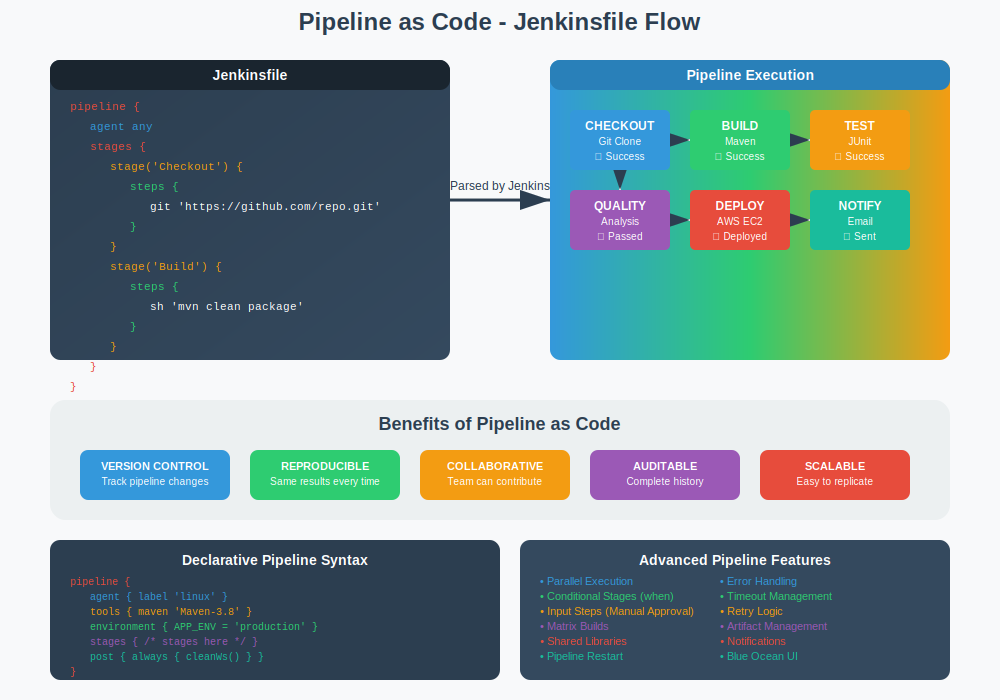

# 📜 Module 04: Pipeline Fundamentals

<div align="center">


**🎯 Pipeline as Code | 📜 Jenkinsfile Mastery | 🚀 Modern CI/CD**

</div>

---

## 📋 Module Overview

This module introduces you to Jenkins Pipelines - the modern, code-based approach to defining CI/CD workflows. You'll learn to create, manage, and optimize pipelines using Jenkinsfiles.

<div align="center">



</div>

### 🎯 **Learning Objectives**
- ✅ Understand Pipeline as Code concepts
- ✅ Create declarative and scripted pipelines
- ✅ Master Jenkinsfile syntax and structure
- ✅ Implement pipeline stages and steps
- ✅ Use Jenkins snippet generator effectively

---

## 🛤️ Module Structure

<table>
<tr>
<th width="10%">Project</th>
<th width="30%">Name</th>
<th width="40%">Description</th>
<th width="20%">Skills</th>
</tr>

<tr>
<td><strong>4.1</strong></td>
<td><strong><a href="./4.1_helloworld_pipeline">Hello World Pipeline</a></strong></td>
<td>Create your first simple pipeline with basic stages and steps</td>
<td>Pipeline Basics, Groovy Syntax, Stage Definition</td>
</tr>

<tr>
<td><strong>4.2</strong></td>
<td><strong><a href="./4.2_pipeline_no_jenkinsfile">Pipeline without Jenkinsfile</a></strong></td>
<td>Build pipelines directly in Jenkins UI without external Jenkinsfile</td>
<td>UI-based Pipelines, Pipeline Script, Direct Configuration</td>
</tr>

<tr>
<td><strong>4.3</strong></td>
<td><strong><a href="./4.3_maven_jenkinsfile_pipeline">Maven Jenkinsfile Pipeline</a></strong></td>
<td>Create Maven-based pipeline with Jenkinsfile stored in SCM</td>
<td>Jenkinsfile, SCM Integration, Maven Automation</td>
</tr>

<tr>
<td><strong>4.4</strong></td>
<td><strong><a href="./4.4_snippet_generator">Snippet Generator</a></strong></td>
<td>Use Jenkins snippet generator for pipeline development and syntax help</td>
<td>Code Generation, Pipeline Development, Syntax Reference</td>
</tr>

</table>

---

## 📚 Theory: Pipeline as Code

### **What is Pipeline as Code?**
Pipeline as Code is the practice of defining your CI/CD pipeline in code (Jenkinsfile) that can be version controlled, reviewed, and maintained alongside your application code.

#### **Key Benefits:**
- 🔄 **Version Control** - Track pipeline changes over time
- 👥 **Code Review** - Team collaboration on pipeline changes
- 🔄 **Reproducibility** - Consistent pipeline execution
- 📊 **Auditability** - Complete history of pipeline modifications
- 🚀 **Portability** - Easy to move between Jenkins instances

### **Pipeline Types**

#### **1. Declarative Pipeline (Recommended)**
```groovy
pipeline {
    agent any
    
    stages {
        stage('Build') {
            steps {
                sh 'mvn clean compile'
            }
        }
        
        stage('Test') {
            steps {
                sh 'mvn test'
            }
        }
    }
}
```

**Advantages:**
- 🎯 **Structured Syntax** - Easier to read and maintain
- 🔒 **Built-in Validation** - Syntax checking before execution
- 📊 **Better Error Handling** - Clear error messages
- 🎨 **Blue Ocean Support** - Enhanced visual pipeline editor

#### **2. Scripted Pipeline**
```groovy
node {
    stage('Build') {
        sh 'mvn clean compile'
    }
    
    stage('Test') {
        sh 'mvn test'
    }
}
```

**Advantages:**
- 🔧 **Maximum Flexibility** - Full Groovy scripting power
- 🎯 **Complex Logic** - Advanced conditional and loop constructs
- 🔄 **Dynamic Behavior** - Runtime pipeline modification

---

## 🏗️ **Pipeline Structure**

### **Essential Components**

#### **1. Agent Declaration**
```groovy
pipeline {
    agent any  // Run on any available agent
    // or
    agent { label 'linux' }  // Run on specific agent
    // or
    agent none  // No global agent, specify per stage
}
```

#### **2. Stages and Steps**
```groovy
stages {
    stage('Checkout') {
        steps {
            git 'https://github.com/user/repo.git'
        }
    }
    
    stage('Build') {
        steps {
            sh 'mvn clean package'
        }
    }
}
```

#### **3. Post-build Actions**
```groovy
post {
    always {
        cleanWs()  // Clean workspace
    }
    success {
        archiveArtifacts 'target/*.jar'
    }
    failure {
        emailext subject: 'Build Failed', body: 'Check logs'
    }
}
```

#### **4. Environment Variables**
```groovy
environment {
    MAVEN_OPTS = '-Xmx1024m'
    BUILD_VERSION = '1.0.0'
}
```

#### **5. Tools Configuration**
```groovy
tools {
    maven 'Maven-3.8.1'
    jdk 'JDK-11'
}
```

---

## 🔧 **Advanced Pipeline Features**

### **Parallel Execution**
```groovy
stage('Parallel Tests') {
    parallel {
        stage('Unit Tests') {
            steps {
                sh 'mvn test'
            }
        }
        stage('Integration Tests') {
            steps {
                sh 'mvn integration-test'
            }
        }
    }
}
```

### **Conditional Execution**
```groovy
stage('Deploy') {
    when {
        branch 'main'
    }
    steps {
        sh 'deploy.sh'
    }
}
```

### **Input Steps**
```groovy
stage('Deploy to Production') {
    input {
        message "Deploy to production?"
        ok "Deploy"
        parameters {
            choice(name: 'ENVIRONMENT', choices: ['staging', 'production'])
        }
    }
    steps {
        sh "deploy.sh ${ENVIRONMENT}"
    }
}
```

---

## 🚀 Getting Started

### **Prerequisites**
- ✅ Jenkins with Pipeline plugin installed
- ✅ Basic understanding of Groovy syntax
- ✅ Familiarity with build tools (Maven, Gradle)
- ✅ Git repository access

### **Development Workflow**
1. **Start Simple** - Begin with Hello World pipeline
2. **Learn Syntax** - Master declarative pipeline structure
3. **Use Snippet Generator** - Leverage Jenkins code generation
4. **Version Control** - Store Jenkinsfiles in SCM
5. **Iterate and Improve** - Continuously enhance pipelines

---

## 📊 Expected Outcomes

After completing this module, you will have:

### **Technical Skills**
- ✅ **Pipeline Creation** - Build pipelines from scratch
- ✅ **Jenkinsfile Mastery** - Write and maintain Jenkinsfiles
- ✅ **Syntax Proficiency** - Understand declarative and scripted syntax
- ✅ **Tool Integration** - Configure tools and environments

### **Best Practices**
- ✅ **Code Organization** - Structure pipelines effectively
- ✅ **Error Handling** - Implement proper error management
- ✅ **Performance Optimization** - Create efficient pipelines
- ✅ **Maintainability** - Write readable and maintainable code

---

## 🔍 Common Pipeline Patterns

### **Basic Build Pipeline**
```groovy
pipeline {
    agent any
    
    stages {
        stage('Checkout') {
            steps {
                checkout scm
            }
        }
        
        stage('Build') {
            steps {
                sh 'mvn clean package'
            }
        }
        
        stage('Test') {
            steps {
                sh 'mvn test'
            }
            post {
                always {
                    junit 'target/surefire-reports/*.xml'
                }
            }
        }
        
        stage('Archive') {
            steps {
                archiveArtifacts 'target/*.jar'
            }
        }
    }
}
```

---

## ➡️ Next Steps

Once you've mastered pipeline fundamentals:
1. **Practice Complex Scenarios** - Multi-stage pipelines
2. **Explore Advanced Features** - Parallel execution, conditionals
3. **Proceed to Module 05** - [Advanced Pipelines](../05_advanced_pipelines/README.md)

---

<div align="center">

### 🎯 **Ready to Master Pipeline as Code?**

**Start Learning: [4.1 Hello World Pipeline](./4.1_helloworld_pipeline/README.md)**

*Transform your CI/CD with modern pipeline practices!*

</div>
